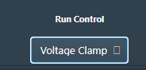
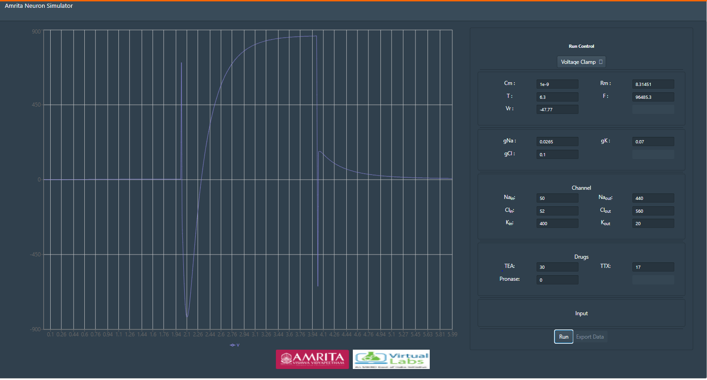

## Procedure

•	 This exercise focuses on studying the relationship between ion channel properties and the V-I Curve. To study the  important parameters recorded from a voltage clamp experiment to plot V-I curve to formulate the kinetics of voltage activated ion channels responsible for excitation (Na+, K+, fast gates, slow gates, etc.).

•	By default the simulator window will be in current clamp mode, for every reset the mode will reset to current clamp. For studying voltage-current plot, access the voltage clamp mode by clicking the drop down list Run control menu and select Voltage clamp. 

&nbsp;

### Understanding Simulator Parameters

Cm  = Membrane Capacitance (nF)

Rm  = Membrane resistance (MΩ)

Vr  = Resting Voltage (mV)

T = Temperature (0C)	

F= Frequency (Hz)
 
 
 &nbsp;
 

gNa = Conductance of Sodium ions

gK= Conductance of Potassium ions

gCl= Conductance of Chloride ions
 

 &nbsp;
 

•	 Membrane window provides accesses to internal and external ionic concentration (Sodium, chloride and potassium) and membrane properties.

 

 &nbsp;
 

•	 Drug window helps to study the pharmacological effect in neuronal membrane by the application of three drugs TTX (Inhibit Na current), TEA (Inhibit K current), Pronase (eliminate Na+ inactivation).Drugs can be applied at any point of time. 

 

 &nbsp;
 

•	 Input parameters are different voltages applied to simulate HH neuron models for applied voltages. 
 

•	 Click on run  button to execute simulator. 

•	 The resulting plot indicates the total ionic current in response to the applied voltage. 

•	 Finally the V-I curve for sodium / potassium can be plotted by assigning peak evoked INa/IK on y-axis and applied step voltage on x-axis. Peak sodium current can be estimated directly from simulator by moving mouse over the peak of the trace. 

•	Tetrodotoxin blocks action potentials in nerves by binding to the voltage-gated, fast sodium channels in nerve cell membranes, essentially preventing any affected nerve cells from firing by blocking the channels used in the process. The effect of TTX drug can be simulated in Hodgkin and Huxley neuron by altering the conductance of sodium channels. The effect of TEA drug can be simulated in Hodgkin and Huxley neuron by altering the conductance of potassium channels.
 
 

