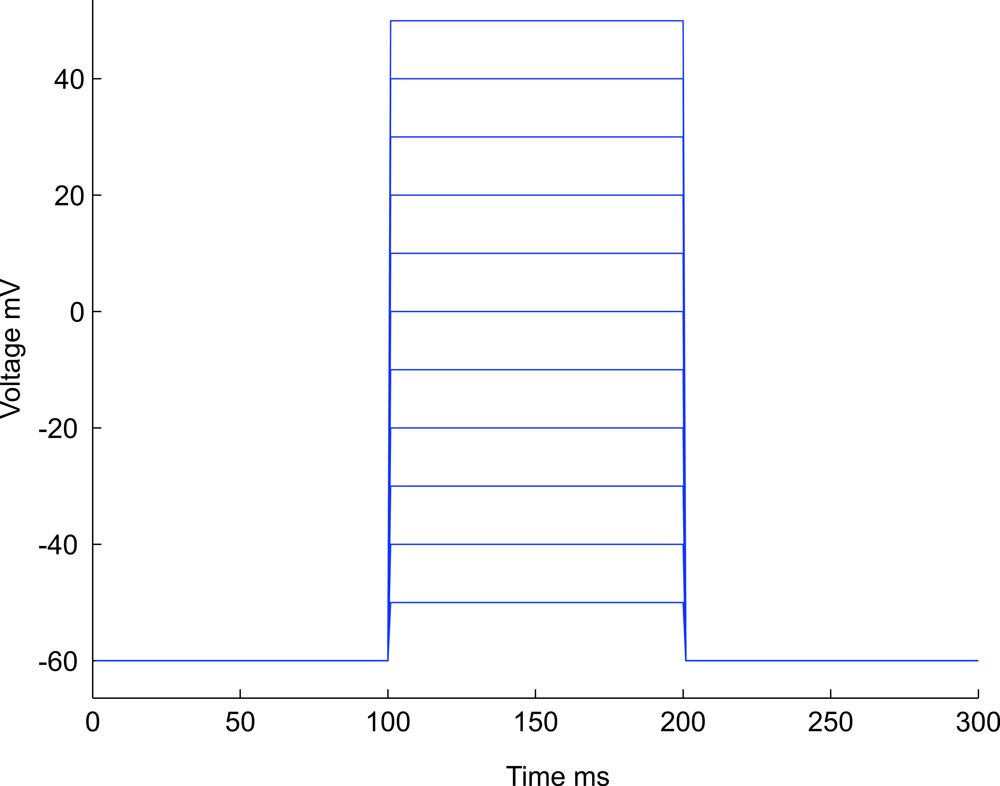
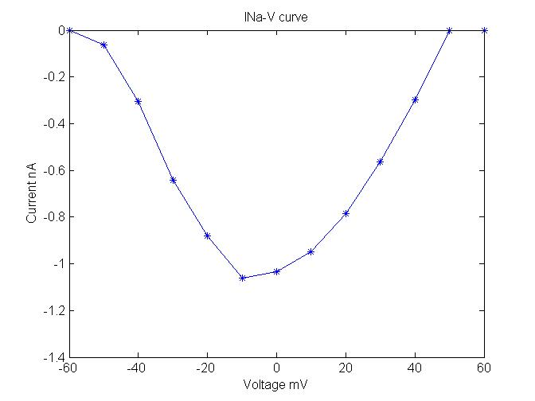
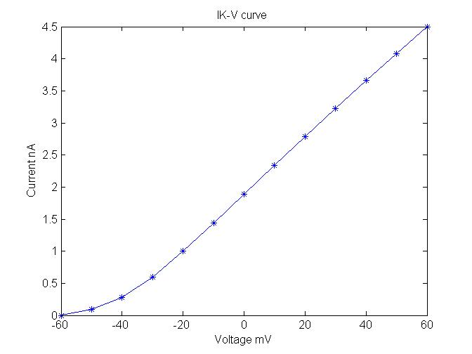
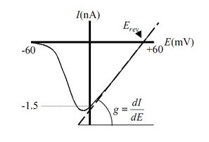

Voltage clamp method  has been used as the most popular biophysical technique for the last few decades. Voltage clamp protocol is used to study a minute patch of neuronal membrane sealed to the end of glass pipette by measuring the current. This method was the best basic biophysical technique used for studying the ion channels. Most of the classical electrophysiology work uses the protocol that, the current applied as a stimulus and measure the changes in the membrane potential. These applied current flow locally across the membrane as ionic and capacitive current. But in voltage clamp protocol reverses the process. For voltage clamp protocol study the membrane potential has to be keeping constant. Measuring the current by holding the membrane voltage constant for sometime then releases the membrane resting voltage. The advantage of this technique is, it can minimize the local spread of local circuit current, so that the observed current can be a direct measure of ionic movement across the membrane.

 **V-I curve**

V-Icurves are plotted to study the property of any electrical system, neurophysiologist uses this relationship between current and voltage to study ion channel kinetics. In electrophysiology V-I curve plots voltage from recoded membrane potential difference between potential inside and outside, current as recorded flow of ions across ion channels.  

 

The term current – voltage curve or V-I curve is refers to the voltage –current relationship of ion channel activation and voltage-dependence of inactivation. Neurophysiologist study this V-I curve to understand the relationship between current and voltage to model biophysical properties of a nerve cell. The flow of current across ion channels is measured using patch clamp technique. Patch clamp technique usually used to study the voltage dependence of a particular channel.

 

Computational neuroscientists’ model ion channel kinetics towards best fit to this V-I curve. V-I curves are used to calculate the reverse potential of a membrane (when all the ion channels are open) and the reverse potential caused by a particular type of ion channel can also be estimated by the application of ion channel blockers. For example TTX is used to record voltage dependent sodium current.   

 

Electrically excitable cells neuron has basically two types of ion channels, voltage gated and non-voltage gated. Non-voltage gated ion channels are always open and this category of channels are mainly responsible for maintaining the resting potential.

 

 
&nbsp;

 
 

Fig 1. Shows the voltage steps with an increment of 10 mV from -60mV to +50 mV.

 

In voltage clamp protocol almost all type of voltage gated channels were closed at the applied voltage (- 60 mV) but it opens when the voltage stepped to more positive values (-40mV). When the voltage stepped value reached 0 mV almost all channels were opened, in case of voltage gated sodium channel see Fig. 2, in case of voltage gated potassium channel see Fig. 3.

 
 
&nbsp;

 
 

Fig 2. Plot shows the V-I relation between peaks evoked sodium current and step potential.

 

The above figure shows the relation between peak inward current and membrane potential and the second half of parabola usually shows more or less straight line the corresponding current peaks between the voltage step value 0 and +60 mV.
 

 
 
&nbsp;

 
 

Fig 3. Shows the V-I relation between peaks evoked potassium current and step potential.

 

And another important use of V-I curve is to calculate the maximum conductance of  an ensemble of ion channels by estimating the slope between current and voltage while fixing reverse potential as origin (see below Fig 4).

 
 
&nbsp;

 
 Adapted from Areles Molleman 2002

Fig 4. V-I curve and calculation of conductance by plotting a straight line on second half of parabola, voltage on x-axis ranges from 0 to +60 mV.

In this case the maximum slope conductance can be calculated using Ohm’s law  gmax = 1.5 nA / 50 mV. 
